## 一、VSCode的安装

1. 进入[VSCode官网](https://code.visualstudio.com/)，下载适用于您电脑版本的VSCode，选择下载Stable版本（稳定版）。
   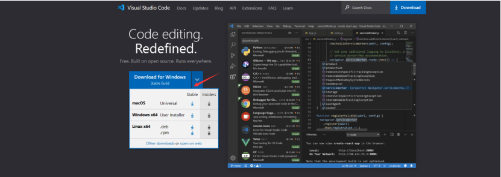

2. 点击"我同意此协议"，然后点击"下一步"。
   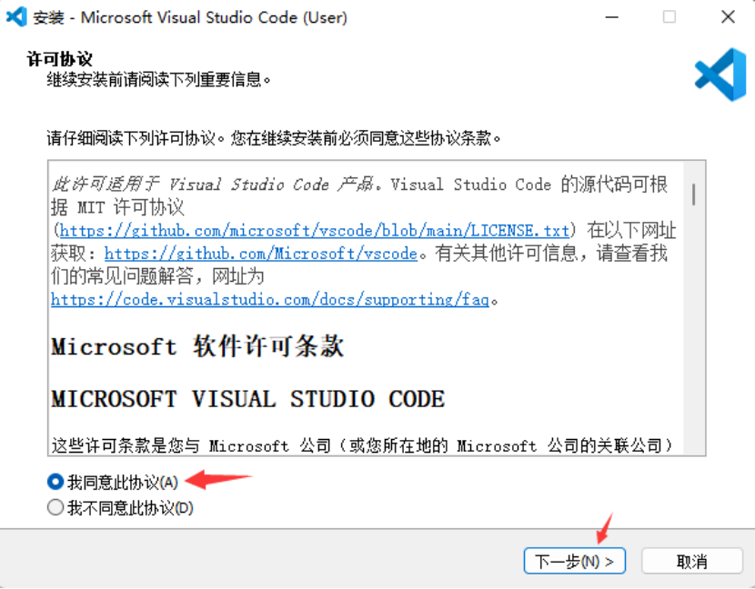

3. 您可以在D盘新建一个名为"vscode"的文件夹，然后点击"浏览"选中此文件夹，以将VSCode安装在D盘（注：只需创建名为"vscode"的文件夹，点击浏览选中后会自动生成"Microsoft VS Code"文件夹），然后点击"下一步"。
   

4. 点击"下一步"。

   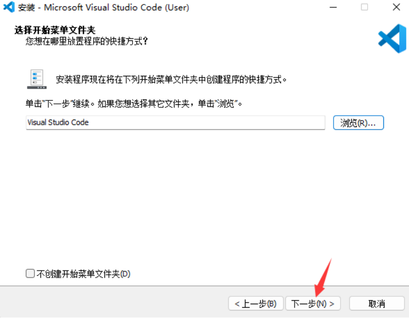

5. 除了将"Code"注册为受支持的文件类型的编译器不勾选之外，其他的均勾选上，然后点击"下一步"。
   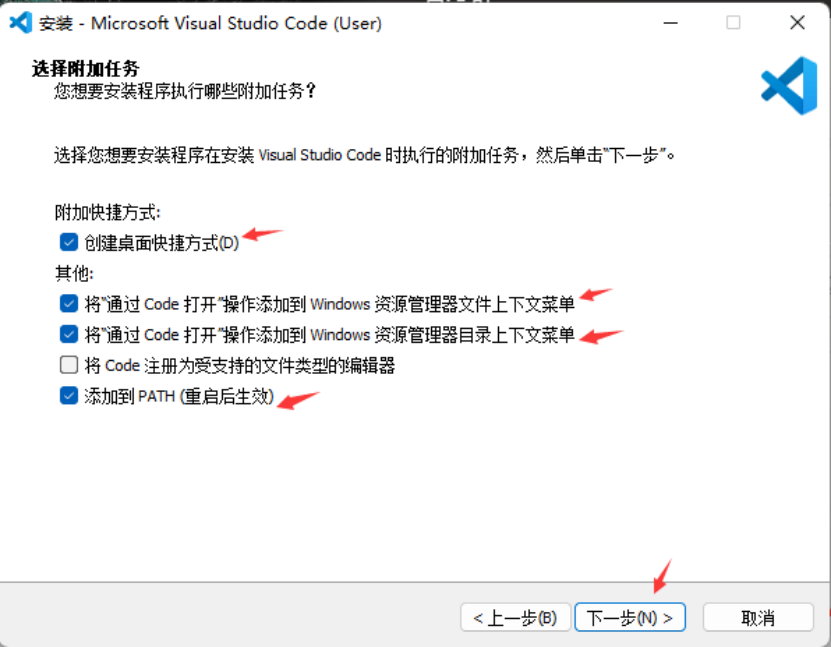

6. 点击"安装"，等待安装完成。
   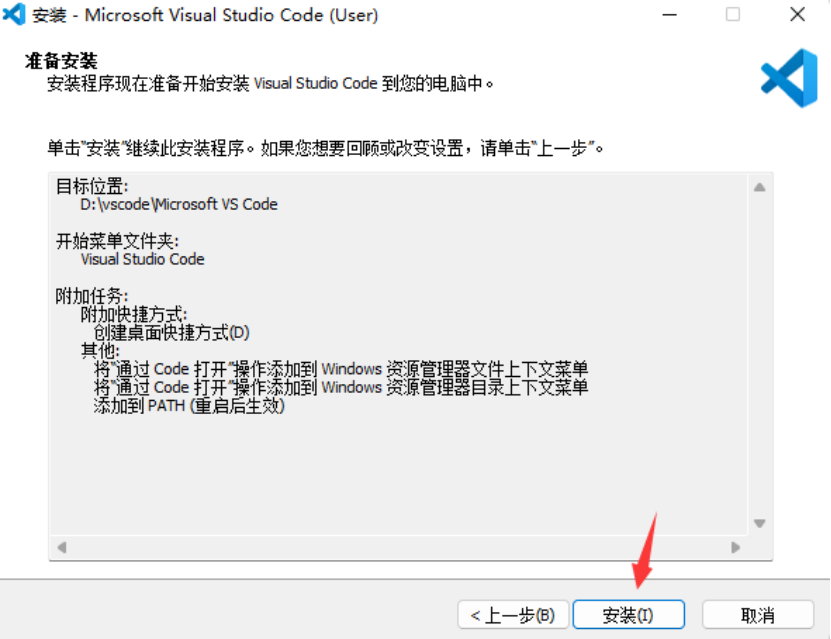

7. 安装完成后，在进度条完成之后点击"完成"。
   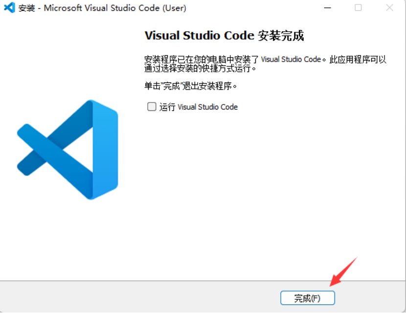

   

## 二、VSCode的使用

1. 在桌面找到VSCode图标并打开。

   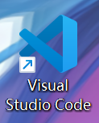
2. 点击"扩展"并安装插件。
   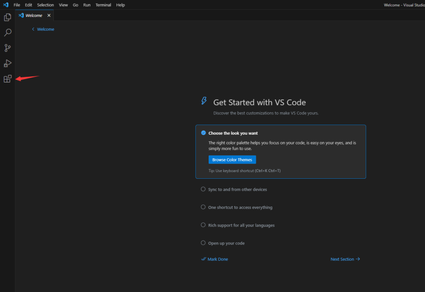
3. 输入"chinese"，然后安装第一个汉化插件（点击"Install"），然后重启VSCode。
   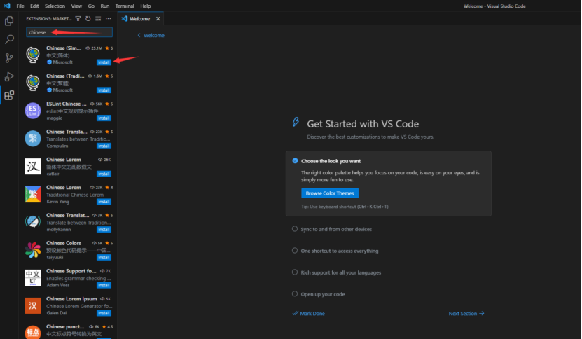
4. 重启后点击"扩展"，然后在搜索框输入"python"，点击安装Python插件。
   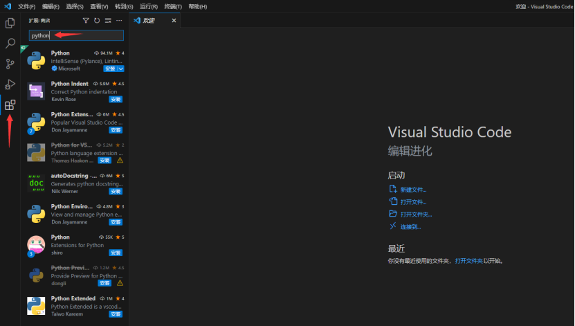
5. 在D盘创建一个名为TEST的文件夹并打开（点击左上角的"文件" -> "打开文件夹"），然后创建一个后缀为".py"的文件。（若打开文件夹时有弹出是否信任此文件夹中的文件的作者请选择信任此作者）
   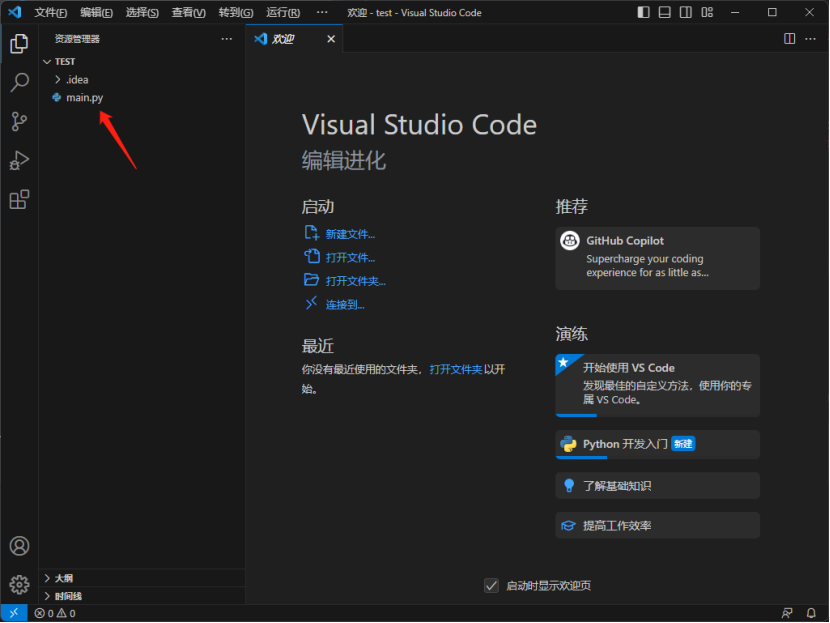
6. 打开"main.py"文件，可以发现默认选择"base"环境。
   
7. 输入图内未注释的代码，点击右上角的三角形运行按钮，下方终端有打印结果就表示操作成功。(#为注释)
   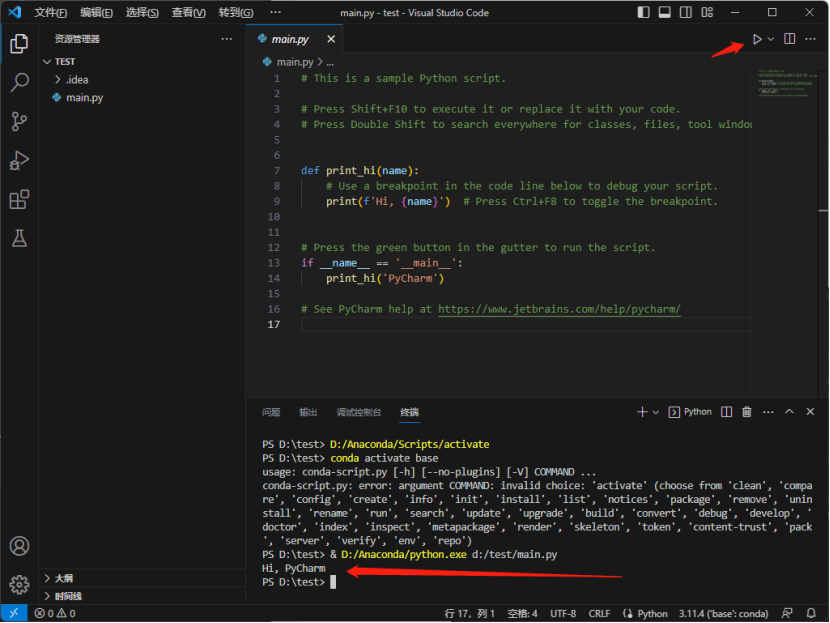


## 三、在 VSCode 中选择 PyTorch 环境

### 1. 打开 VSCode 并加载项目

- 打开 Visual Studio Code (VSCode)。
- 在菜单中选择 "文件" -> "打开文件夹"，然后选择您之前创建的名为 "TEST" 的文件夹。
- 在文件夹中找到并打开 "main.py" 文件。

打开了 "main.py" 文件后，可以通过以下步骤选择 Python 解释器。

### 2. 选择 Python 解释器

- 在右下角的状态栏中，会看到 "base"，点击它会弹出可用的 Python 解释器列表。

  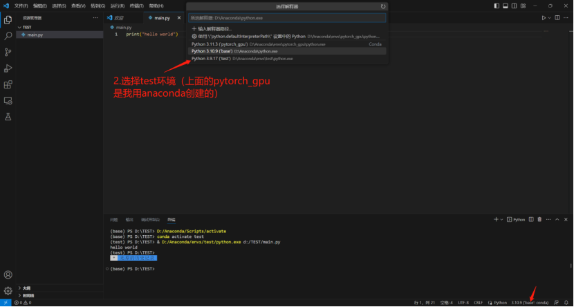

**注意：** 如果您没有看到在 Anaconda 中创建的环境（例如 "test"），您可以手动添加 Python 解释器。

#### 手动添加 Python 解释器

1. 打开 Anaconda Prompt，输入以下命令激活 "test" 环境：

   ```shell
   conda activate test

2. 输入以下命令来查找 `python.exe` 的路径：

   ```
   where python
   ```

3. 复制找到的路径。

4. 回到 VSCode，点击右下角的base，上方会弹出 "输入解释器路径"。

5. 将复制的路径粘贴到输入框中。

现在已经成功选择了正确的 Python 解释器。

### 3. 测试 PyTorch 安装

若您的环境已经安装了 PyTorch，您可以进行以下测试：

- 确保选择已安装 PyTorch 的环境。

- 输入以下命令并运行：

  ```
  import torch
  ```

如果没有报错，即表示 PyTorch 安装成功。

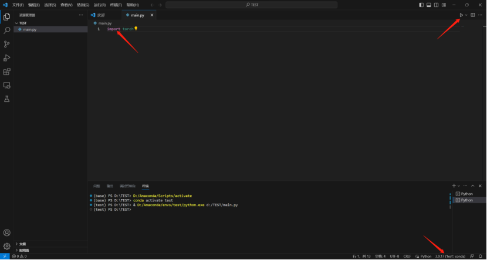

